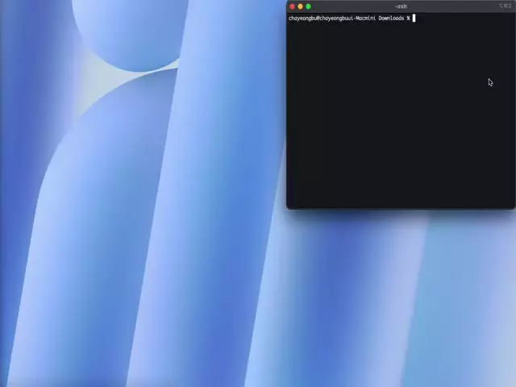

# Soft Landing

A web-based tool that generates ready-to-use landing pages from TOML configuration. Built with React, TypeScript, and Vite for fast, client-side-only operation.

## Demo




## Features

### Currently Available

- **TOML-based Configuration**: Define your landing page structure using simple TOML syntax
- **Real-time Preview**: See changes instantly as you edit your configuration
- **TOML Import**: Import existing TOML configuration files
- **Downloadable Bundles**: Export complete HTML/CSS/JS packages with assets for deployment
- **Basic Theme Customization**: Customize colors, fonts, and styling through configuration

### Planned Features

- **CSS Injection**: Custom CSS for advanced styling and customization
- **Interactive Backgrounds**: Animated and dynamic background effects
- **Pricing Section**: Pricing section for business pages
- **Multi-page Generation**: About, Career, and other page types
- **Hosting Service**: Direct hosting and deployment of generated landing pages

## Quick Start

### Basic Usage

1. **Create a TOML configuration** with your landing page content:

```toml
[theme]
primary_color = "#3b82f6"
secondary_color = "#64748b"

[hero]
title = "Welcome to My Product"
description = "The best solution for your needs"
image_url = "assets/hero_image.png"

[features]
title = "Why Choose Us"

[[features.items]]
title = "Fast & Reliable"
image_url = "assets/feature_item_1_image.png"
```

2. **See the preview** update in real-time as you edit
3. **Download your landing page** as a complete bundle ready for deployment

## Development

### Available Scripts

```bash
# Start development server with hot reload
pnpm dev

# Build for production
pnpm build

# Lint code
pnpm lint

# Preview production build locally
pnpm preview
```

### Architecture

- **Frontend**: React 19 + TypeScript + Vite
- **Styling**: Tailwind CSS + shadcn/ui components
- **TOML Parsing**: Client-side parsing with `@iarna/toml`
- **Editor**: Monaco Editor with TOML syntax highlighting
- **Bundling**: JSZip for creating downloadable packages
- **State Management**: Zustand for lightweight state management

### Key Components

- **TOML Editor**: Monaco-based editor with syntax highlighting
- **Landing Preview**: Real-time preview of the generated landing page
- **Asset Manager**: Handles image uploads and asset management
- **Section Components**: Modular components for Hero, Features, CTA, Footer, etc.

### Deployment

- **Static hosting ready**: Can be deployed to GitHub Pages, Netlify, Vercel
- **Self-contained bundles**: Generated landing pages are completely standalone

## License

MIT License - Feel free to use!

## Support

For questions or support, please [open an issue](../../issues) on GitHub.
